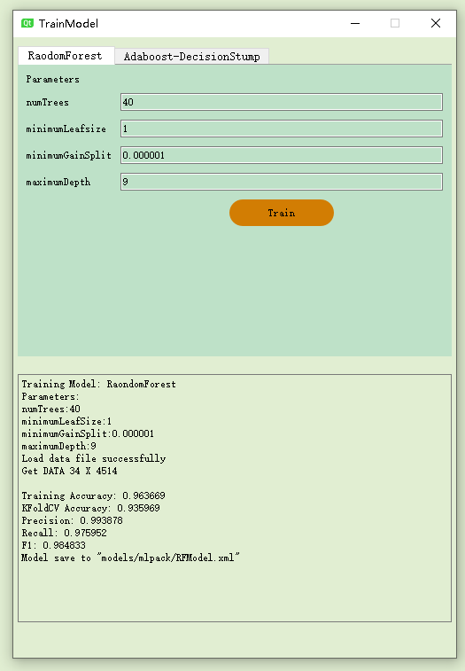

# **MeetingSpy**

Monitor attendants status through face emotion and upper body key point and give feedbacks. It's a reproduction of a paper of CSCW 2019, *[How Presenters Perceive and React to Audience Flow Prediction In-situ: An Explorative Study of Live Online Lecture](https://dl.acm.org/doi/10.1145/3359264)*. 

In the previous research, it shows that if MOOCs' lectures can get a realtime feedbacks in the class, it will help both studsents and teachers improve the effect of the online-class.  Previous model is based on emotion expression and face-keypoint, using Vote(average probabilities) with Decision Tree(C4.5), SVM(RBFKernel), and Multilayer Perceptron(2 hidden layers). The output is 3 dimension of evoluation, anxiety, flow, and boredom. 

My work can be departed into two steps: (1)plus the upper body joint keyt point as input; (2)change the status evaluation models tp Adaboost and Random Forest.

## MENU

  - [**Requirement**](#requirement)
    - [**Dependencies:**](#dependencies)
    - [**Environments:**](#environments)
  - [**Implement**](#implement)
    - [**Interface**](#interface)
    - [**Program**](#program)
    - [**Classification**](#classification)
  - [**Further Improvement**](#further-improvement)

## **Requirement**

### **Dependencies:**
There are three main dependencies of these program. About their detailed installment will discuss in [there](requirements/requirement.md)

1. MLpack
2. Affdex
3. OpenPose

### **Environments:**

1. Visual Studio 2017 or 2019
2. QT 5.12(for UI)
3. Weka 3.8 GUI(for learning data)

## **Implement**

### **Interface**

runtime main interface:

Main camera with upperbody keypoint and face rectangle. Three buttons of starting capture, training models, and selecting the model. A text area show some tips. A current status bar chart and status line chart.

status line (it will record the whole class so that teachers can acknowledge which part of the class is difficult or easy):

current status (realtime status feedback):

There is a embeded mini program of training models(only support Random Forest and Adaboost-DecisionStump). Supprt changing the parameters. Looking for further development of visualization of MLpack.

### **Program**

**Framework Illustration**

The whole program was controlled by the main part Meetingspy, it will send signals picture from camera to other components. The Timer provided by QT is the signal of process frame, to compute the emotion and joint points. All data flow(both face and joint points) will controlled by the static class Dataprocess, it will get the data from OpenPose and Affdex, and send data to MLpack and UI part.

### **Classification**

|Models|Decision Tree(C4.5)|SVM with RBFKernel|Multilayer Perceptron
(2 hidden layers)|Vote with average Probability|Random Forest|Adaboost
(Decision Stump)|Adaboost
(Decision Tree)|
|----|:----:|:----:|:----:|:----:|:----:|:----:|:----:|
|10-Folds Cross
 Val Acc|93.46%|75.45%|85.62%|91.56%|97.56%|67.03%|97.52%|
|Precision|93.50%|77.00%|85.70%|91.60%|97.60%|65.90%|97.50%|
|Recall|0.935|0.754|0.856|0.916|0.976|0.67|0.975|
|F-Measure|0.935|0.727|0.856|0.916|0.976|0.645|0.975|

I firstly used Weka3.8 to select models. same as previous work, I used C4.5, SVM, MLP, and Vote. Actually, tree model is the best one, and the Vote way seems to lessen the Acc of Decision Tree. So, I tried to find other ways, focus on ensemble learning. So, I chose RandomForest and Adaboost. The default way of Adaboost use Decision Stump(a simple 1 level tree), but it cannot give a high-performence model. I always wonder if I can use strong learner to replace the weak learner of Adaboost. So, I tried it in Weka, using C4.5 to replace the Decision Stump. It actually boost the performance, but it also takes more time to train the model(3-4 times than normal way). Since it can not limit the level of learner C4.5, so I guess there are a lot of waste in this way. And then, I chose to implement in MLpack, to limit the level of the decision tree as weak learner.

|Models|Decision Tree|Random Forest|Adaboost
(DecisionStump)|Adaboost
(Perceptron)|Adaboost
(DecisionTree)|
|-|:--:|:-:|:-:|:-:|:-:|
|10-Folds Cross
 Val Acc|74.95%|93.49%|91.62%|81.10%|92.57%|
|Precision|61.37%|98.97%|99.59%|79.95%|91.84%|
|Recall|0.789|0.969|0.977|0.799|0.947|
|F-Measure|0.691|0.979|0.986|0.799|0.932|

The default weak learner of Adaboost in MLpack is Perceptron, and I used DecisionStump and DecisionTree. In this tool, we can limit the level of the DecisionTree. If we want to regard decision tree as a weak learner, we have to limit its size small. So, I chose 10 level to train the model. Other parameters of Adaboost part is same as DecisionStump. The result shows that even the Acc of DecisonTree mode is higher than DecisionStump mode, but other measures are still lower. And the time, the DecisionTree mode is also longer. 

But consider the lack of data, it may be different(actually it won't be different, maybe). So finally, I chose RandomForest and Adaboost-DecisionStump as the classification models in this program.

## **Further Improvement**

1. **[Important]** I will still gather data, it is still lack of data(Only 3.4k line of the data).
2. Test more models.(And I am still wondering to build up a visulized MLpack training program)
3. Multi-audiences. It is hard to match the face data and joint data in this implemention, because these two classes of data come from different SDK.
